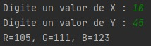
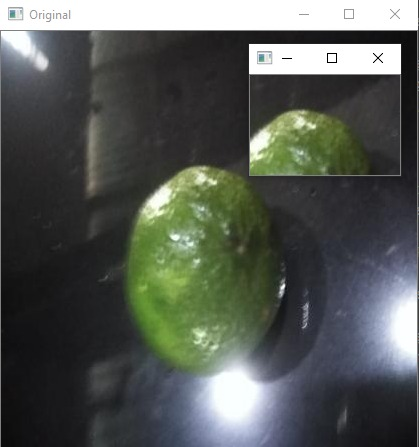
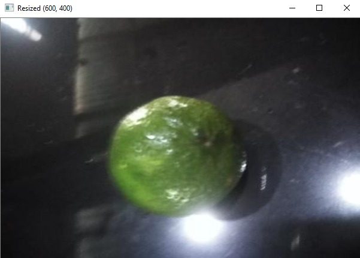
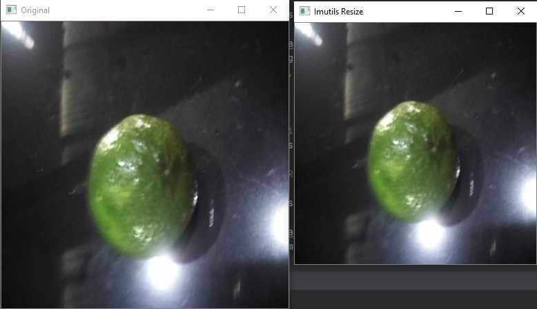
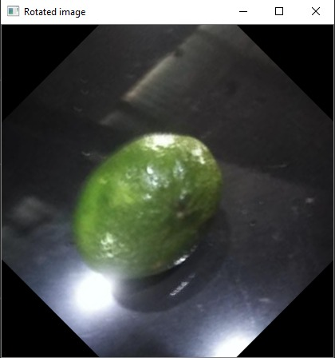

# Instituto Tecnológico de Costa Rica

# Campus Tecnológico Local San Carlos

# Escuela de Ingeniería en Computación

# Introducción al Reconocimiento de Patrones

# Laboratorio 1

# Fabian Zamora Rivera
# Randald Villegas Brenes

# II Semestre, 2020

### Introducción

La visión por computadora se ha vuelto una tendencia en la rama de la inteligencia artificial. Cada vez existen más aplicaciones que se le puede dar al análisis y procesamiento de imágenes, tanto para uso industrial y común. 

**OpenCV** es una de las librerías más robustas para llevar a cabo tareas relacionadas a la visión por computador. Cuenta con más de quinientas funciones para el procesamiento de imágenes, cómo lo pueden ser el reconocimiento de objetos, detección de movimiento, visión robótica, entre otras.

A continuación se van a mencionar 6 ejemplos específicos en los cuales sirven como herramientas para encontrar patrones en imágenes y poderlas clasificar utilizando el poder del procesamiento de una computadora, ya que algunas de estas características no son fáciles de percibir por el ojo humano.

* **Desplegar el R,G,B de un píxel para un x,y proporcionado por el usuario.**
~~~
  def get_rgb(x, y):
    image = cv2.imread("image1.jpg")
    (B, G, R) = image[x, y]
    print("R={}, G={}, B={}".format(R, G, B))
    cv2.imshow("Get RGB(X , Y)", image)
    cv2.waitKey(0)
    cv2.destroyAllWindows()
~~~

* **Extraer una región de una imagen una región (ROI) se deben solicitar los dos pares (x,y)inicio y fin y desplegar la imagen recortada. Existen ocasiones en que es necesario hacer énfasis en un sector de la imagen, por lo que extraer una región en específico suele ser la mejor opción. Para llevar a cabo esta función se utiliza el siguiente código:**
~~~
def prepare_data():
    x1 = int(input("Digite un valor de inicio 1: "))
    y1 = int(input("Digite un valor de fin 1 : "))
    x2 = int(input("Digite un valor de inicio 2: "))
    y2 = int(input("Digite un valor de fin 2: "))
    if x1 < x2 and y1 < y2:
        method2(x1, y1, x2, y2)
    else:
        print("\t\n Error, el inicio debe de ser más pequeño que el fin..!\n")
        prepare_data()

def method2(x1, y1, x2, y2):
    image = cv2.imread("image1.jpg")
    roi = image[x1:y1, x2:y2]
    cv2.imshow("Original ", image)
    cv2.imshow("ROI", roi)
    cv2.waitKey(0)
    cv2.destroyAllWindows()
~~~

* **Permitir ajustar el tamaño de una imagen solicitando nueva dimensión en píxeles y muestra la imagen resultante. En caso de necesitar ajustar el tamaño de una imagen se procede de la siguiente manera:**
~~~
def resize_image(image_name, x,y):
    img = cv2.imread(image_name)
    res = cv2.resize(img, (x, y))
    return res
~~~

* **Redimensiona una imagen pero sin alterar el aspecto, Si lo que se desea es ajustar las dimensiones de la imagen sin afectar sus proporciones originales se utiliza el siguiente código:**
~~~
def method4(w):
    image = cv2.imread("image1.jpg")
    resized = imutils.resize(image, width=w)
    cv2.imshow("Original ", image)
    cv2.imshow("Imutils Resize", resized)
    cv2.waitKey(0)
    cv2.destroyAllWindows()
~~~

* **Rotar una imagen la cantidad de grados que el usuario requiera. La rotación de imágenes es una herramienta de uso reiterativo a la hora de procesar imágenes, OpenCV cuenta con la función getRotationMatrix2D() para llevarlo a cabo.**
~~~
def rotate_image(image_name, angle, dir):
    image = cv2.imread(image_name)
    image_center = tuple(numpy.array(image.shape[1::-1]) / 2)
    if dir == 1:
        rot_mat = cv2.getRotationMatrix2D(image_center, -angle, 1.0)
    else:
        rot_mat = cv2.getRotationMatrix2D(image_center, angle, 1.0)
    result = cv2.warpAffine(image, rot_mat, image.shape[1::-1], flags=cv2.INTER_LINEAR)
    return result
~~~

* **Suavizar una imagen mediante un blur con un kernel Gaussiano. Aplicar filtros para suavizar una imagen puede ser de gran ayuda para reconocer patrones en imágenes, ya que pueden eliminar o ampliar características para llevar a cabo la clasificación y toma de decisiones. En este caso se aplica el filtro blur con un kernel Gaussiano:**
~~~
def blur():
    image = cv2.imread('image1.jpg')
    blurred = cv2.GaussianBlur(image, (11, 11), 0)
    cv2.imshow("Original ", image)
    cv2.imshow("Blurred", blurred)
    cv2.waitKey(0)
    cv2.destroyAllWindows()
~~~

### Conclusión

La visión artificial o visión por computador está creciendo de manera exponencial, ya que se está integrando a diferentes áreas y posee un sin fin de aplicaciones, cada día hay más problemas o tareas los cuales pueden ser automatizadas y la visión por computadora  es una área a explotar para cumplir las diferentes tareas realizadas por mano de obra humana pero con menos probabilidades de fallas.

### Referencias
[A. Rosebrock, “Opencv tutorial: A guide to learn opencv.” [Online]. A](https://www.pyimagesearch.com/2018/07/19/opencv-tutorial-a-guide-to-learn-opencv/)

[R. Szeliski,Computer vision: algorithms and applications. Springer Science & Business Media,2010.]

[G. Guides, “Mastering markdown.” [Online]. Available:](https://guides.github.com/features/mastering-markdown/)
